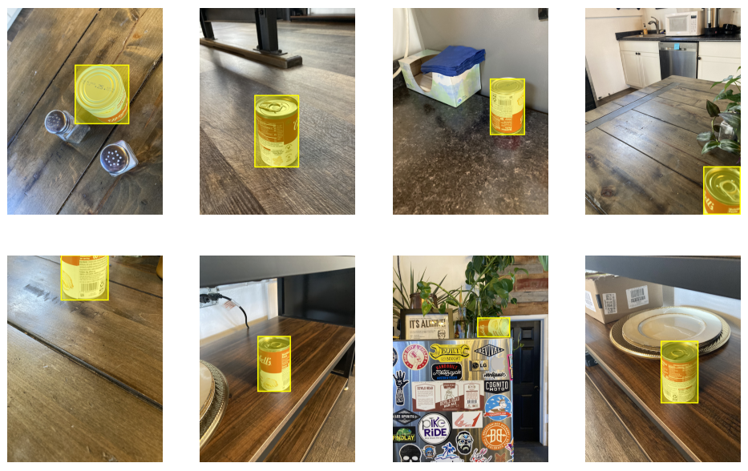
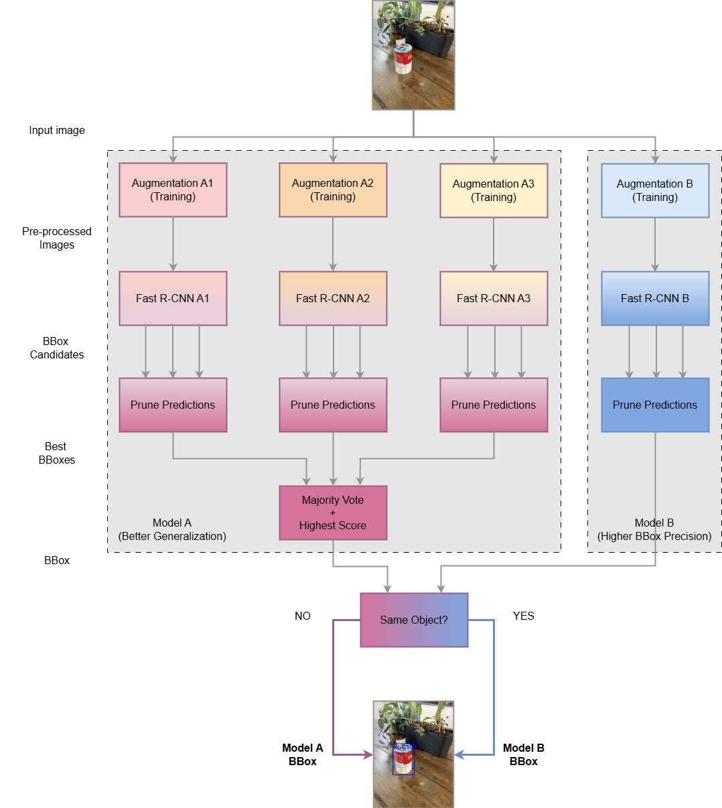
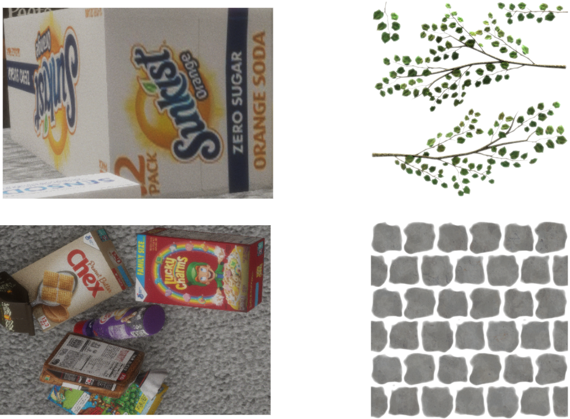
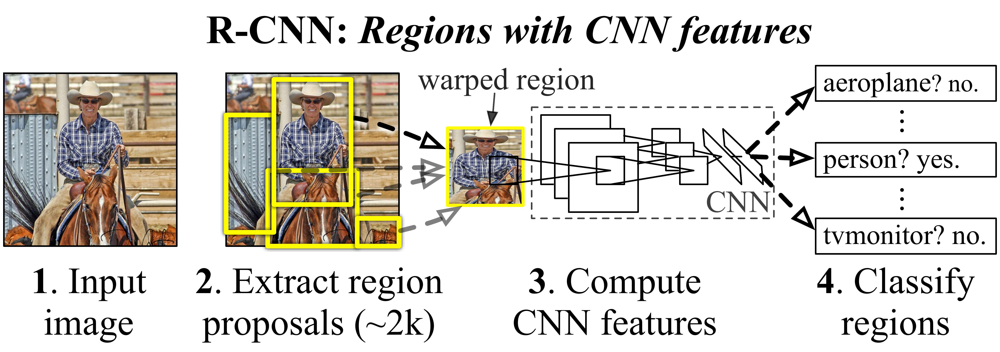
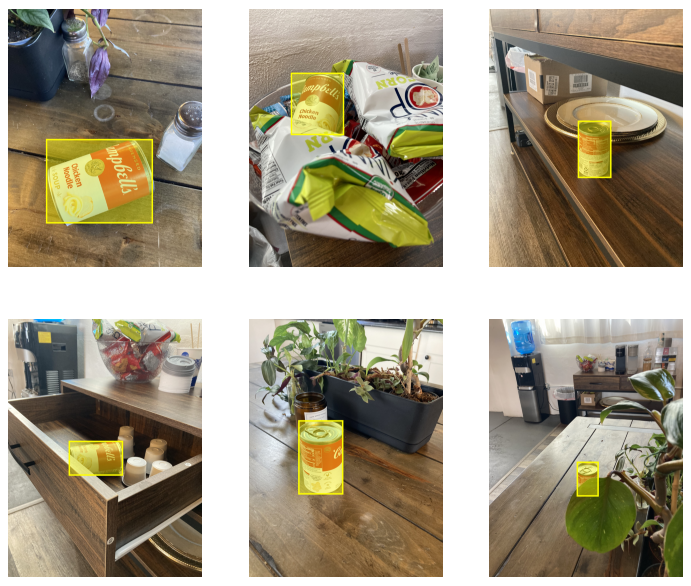

# Leveraging Synthetic Data for Real-World Object Detection - 2nd Edition

By [Sergio Sanz, PhD](https://www.linkedin.com/in/sergio-sanz-rodriguez/).

## 1. Introduction

This article outlines the algorithmic solution developed for the [Synthetic to Real Object Detection Challenge - 2nd Edition](https://www.kaggle.com/competitions/synthetic-2-real-object-detection-challenge-2) on Kaggle, organized by [Duality AI](https://www.duality.ai/).

  

In this second edition of the challenge, participants were tasked to train models on synthetic images of a soup can (generated via Duality AI’s digital twin simulation software called Falcon) and generalize effectively to unseen real-world images.

As in the [previous challenge](https://www.kaggle.com/competitions/synthetic-2-real-object-detection-challenge), the proposed model is based on PyTorch's Region-based Convolutional Neural Network (R-CNN), specifically the [Faster R-CNN](https://www.kaggle.com/competitions/synthetic-2-real-object-detection-challenge) implementation.

A central component of the proposed method is an **augmentation-based regularization** strategy to enhance generalization. Strong data augmentation techniques, including horizontal and vertical flip, perspective, zooming out, occlusions, color jittering, and resolution scaling, are applied throughout training. Another key aspect of the proposed solution was the use of **ensemble learning** to improve generalization.

Additional highlights of this approach include:

* Synthetic-only training: No real-world images were used during training or validation.

* No pseudo-labeling: The model was trained solely on the labeled synthetic data provided in the competition.

* Pre-trained backbone: A Faster R-CNN model leveraging a pre-trained backbone was fine-tuned on the synthetic Cheerios box dataset provided in the competition.

  

## 2. The Proposed Pipeline

Compared to the previous challenge (1st Edition), the second edition has turned out to be significantly more difficult. This increased difficulty is primarily due to the simplicity of the training and validation datasets, which contrasts with the complexity of the real-world test dataset. In the first edition, a single Faster R-CNN network was used for object detection. In contrast, the current pipeline is considerably more sophisticated, as illustrated in Figure 1.

  

  <figcaption>Figure 1: Block diagram of the proposed object detection pipeline.</figcaption>

The pipeline consists of two models—Model A and Model B—as well as a Meta-decision stage.

### 2.1. Model A: Better Generalization

Model A consists of three deep learning models—A1, A2, and A3—that each make predictions on the same input image. Ensemble learning is applied to their outputs to (1) identify the most frequently detected object (majority vote) and (2) select the bounding box (BBox) with the highest confidence score. Model A is specifically designed to improve generalization.

During training, each model path uses a different augmentation strategy to promote prediction diversity, making it more likely that at least one model captures patterns the others might miss.

However, Model A often produces bounding boxes with relatively low precision.

### 2.2. Model B: Bounding Box Refinement

Model B relies on a single R-CNN network specifically trained to produce high-precision bounding boxes. Notably, removing artificial rotations during the augmentation stage was found to improve both the confidence of the detection scores and the accuracy of the bounding boxes, an effect similar to label smoothing in classification tasks. 

While this model achieves superior localization accuracy, it tends to generalize less effectively than Model A, as it produces a higher number of false positives.

### 2.3. Meta-decision

A meta-decision block is incorporated into the pipeline to combine the outputs of Models A and B, leveraging the strengths of both. If both models detect the same object, the bounding box from Model B is selected due to its higher precision. Otherwise, the bounding box from Model A is used, assuming the test image represents a more challenging case.

## 3. Training and Validation datasets

The default dataset provided for this challenge consists of five sets of images: a baseline dataset and four additional variations differing in lighting conditions, furniture elements, plant presence, and camera distances. However, these datasets are relatively simplistic, as they contain very few surrounding elements that could serve as occlusion factors for the object of interest.

To introduce more occlusion elements, a new dataset was generated using the Falcon engine software. It includes 2,854 training images and 479 validation images, featuring additional objects that could potentially occlude the object of interest—the soup can. Although this new dataset contains only a few meaningful occlusions, it was added to the original dataset to increase the overall number of training samples, with the goal of improving generalization. Altogether, the combined dataset consists of **3,870 training images and 826 validation images** (approximately 20% of the training set).

To further increase the likelihood of occlusion, some objects from the new dataset were exported in PNG format and randomly overlaid onto the images from the entire dataset during the augmentation stage of the pipeline (see next section). 

## 4. Data Preprocessing: Augmentation

For each model, a dedicated data augmentation pipeline is employed to improve generalization. It includes a variety of image transformations such as resolution scaling, color jittering, horizontal flipping, vertical flipping, perspective, rotation, zooming out, and—most notably—occlusions. A large number of occlusions are introduced to simulate edge cases (see Figure 2).

Occlusions are applied by randomly overlaying colored circles and rectangles of different sizes onto the images. In addition, synthetic bush and stone textures, as well as other objects—as shown in Figure 2—sourced from the Falcon engine software, are composited onto the training images to better replicate complex, real-world scenarios.

  

  <figcaption>Figure 2: Examples of objects overlaid onto the image dataset to simulate real-world occlusions using synthetic textures and elements.</figcaption>

## 5. Object Detection Model: Faster R-CNN

**Faster R-CNN** was selected as the object detection architecture due to its strong balance between accuracy and efficiency. It is widely recognized for delivering state-of-the-art performance across various object detection tasks, leveraging a two-stage detection pipeline. This model contains 43.2 million parameters and has a size of 173.4 MB.

The model mainly consists of two stages: Region Proposal Network (RPN), and classification and bounding box regression. These stages are briefly described in the next subsections.

### 5.1. Region Proposal Network (RPN)

The first stage involves scanning the image to identify regions (i.e., bounding boxes) that are likely to contain objects. This step estimates objectness, which is the probability that a given region contains an object rather than background.

Feature extraction for this stage is performed using the ResNet50_FPN_v2  backbone.

### 5.2. Classification and Bounding Box Regression

Once the Regions of Interest (RoI) are proposed by the RPN, the second stage classifies the content of each region (e.g., pedestrian, dog, table, book, Cheerios box) and refines the coordinates of the bounding boxes. The figure below shows a block diagram of the Faster R-CNN architecture.

  

  <figcaption>Figure 3: Block diagram of the Faster R-CNN architecture. Source: R. Girshick, et al. "Rich Feature Hierarchies for Accurate Object Detection and Semantic Segmentation," 2014 IEEE Conference on Computer Vision and Pattern Recognition, June 2014.</figcaption>

## 6. Bounding Box Pruning

Each R-CNN model may generate multiple bounding box candidates for a single image, some of which may correspond to the same object or to different parts of it. To produce cleaner outputs, a post-processing step is applied to remove low-confidence and redundant detections.

This stage aims to retain, for each model, only the most reliable bounding box by applying a custom multi-step filtering algorithm, implemented from scratch. Each step uses thresholds fine-tuned through cross-validation:

1. **Size-based thresholding:** Bounding boxes exceeding a certain size relative to the image size are discarded. This stage helps eliminate unreasonably large, likely inaccurate detections.

2. **Score thresholding:** Only bounding boxes with a confidence score above a predefined threshold are retained.

3. **IoU thresholding:** The Non-Maximum Suppression (NMS) algorithm, [available in PyTorch](https://docs.pytorch.org/vision/main/generated/torchvision.ops.nms.html), is applied to iteratively remove lower-scoring boxes that have an [Intersection over Union (IoU)](https://pyimagesearch.com/2016/11/07/intersection-over-union-iou-for-object-detection/) greater than the defined threshold with a higher-scoring box. In simpler words, a lower IoU threshold results in more aggressive removal of overlapping predictions.

4. **Score-based final selection:** If multiple boxes still remain after the above steps, the one with the highest confidence score is selected. This final step is especially relevant when it is known beforehand that at most one object of a given class is present in the image, as is the case in this challenge.

## 7. Best Candidate Selection

As shown in Figure 1, each model path in Model A proposes its own best bounding box candidate. In the final stage, the pipeline selects the overall winner by choosing the candidate with the highest confidence score associated with the most frequently detected object.

The outputs of Models A and B are then combined using a simple meta-decision rule: if the bounding boxes point to different objects, the decision favors Model A due to its better generalization; otherwise, Model B is chosen to refine the bounding box boundaries.

## 8. Training and Cross-Validation

The deep learning models were trained and cross-validated using the PyTorch framework with the following configuration:

* **Learning rate:** 1e-5.
* **Batch size:** 4.
* **Number of epochs:** 30.
* **Optimizer:** AdamW (weight decay: 0.01, betas: 0.9, 0.999).
* **Scheduler:** CosineAnnealingLR (eta_min: 1e-7).
* **Augmentation A1 (Model A1):** resolution scaling, horizontal flip, vertical flip, rotation, zoom out, color jitter, up to 5 occlusions simultaneously.
* **Augmentation A2 (Model A2):** resolution scaling, horizontal flip, vertical flip, rotation, zoom out, color jitter, , up to 7 occlusions simultaneously.
* **Augmentation A3 (Model A3):** resolution scaling, horizontal flip, vertical flip, rotation, perspective, zoom out, color jitter, up to 8 occlusions simultaneously.
* **Augmentation B (Model B):** resolution scaling, horizontal flip, vertical flip, zoom out, color jitter, , up to 7 occlusions simultaneously.

Note that, in the experiments, Model B uses the same augmentation pipeline as A2, except it excludes rotation.

### 8.1. Loss Function

The Faster R-CNN model returns a dictionary containing the following loss components:

* **Classification loss:** Cross-entropy loss between predicted and ground-truth class labels for each RoI.

* **Bounding box regression loss:** It measures how accurately the predicted bounding boxes align with the ground-truth boxes.

* **Objectness loss:** It helps the RPN determine whether an anchor box contains an object or background.

* **RPN box regression loss:** It evaluates how well the RPN refines anchor boxes to match ground-truth object locations.

The overall loss used for training and cross-validation is the sum of these individual components.

## 9. Experimental Results

The proposed pipeline was evaluated on the test dataset provided by Duality AI as part of the Kaggle competition. Model performance was assessed using the [Mean Average Precision](https://www.v7labs.com/blog/mean-average-precision) at IoU threshold 0.50 (mAP@50).

Figure 4 shows representative examples demonstrating the performance of the proposed model, which achieved perfect object detection. The model obtained **the highest possible score of 1.0** on the leaderboard.

  

  <figcaption>Figure 4: Inference examples exhibiting the performance of the proposed object detection model.</figcaption>

## 10. Conclusion

This work demonstrates the effectiveness of combining synthetic data with a robust object detection architecture and strong data augmentation techniques to address challenging, real-world object detection tasks.

The techniques used are outlined below:

* A significantly larger set of training and validation samples was generated using the Falcon engine software.
* Very strong augmentation—particularly occlusions—was applied to increase data diversity.
* Two models, each optimized for a different objective, were combined using a meta-decision block to leverage the strengths of both approaches.
* Ensemble learning was employed to improve generalization.
* An advanced bounding box pruning algorithm was implemented to reduce detection redundancies.
* The Faster R-CNN model was selected as the base deep learning architecture, demonstrating outstanding performance on real-world test data and highlighting the potential of simulation-driven approaches in computer vision.

To download the article in PDF, click [here](https://github.com/sergio-sanz-rodriguez/Synthetic-To-Real-Object-Detection-Edition-2/raw/main/2025-05-27_Leveraging_Synthetic_Data_for_Real-World_Object%20Detection_2.pdf).

## 11. Acknowledgments

I would like to thank [Duality AI](https://www.duality.ai/) for organizing this amazing competition, and to all participants whose involvement pushed me to consistently enhance the performance of the proposed solution.
